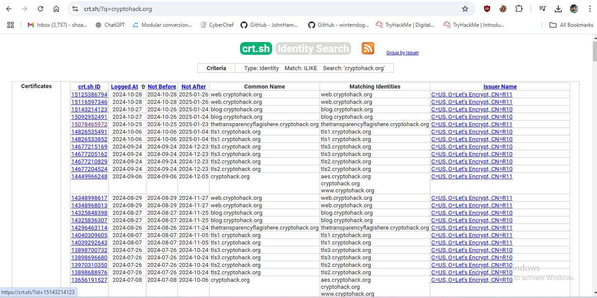

# Certificate Transparency Challenge

This writeup details the approach used to solve a cryptographic challenge involving TLS certificates and Certificate Transparency logs.

## Problem Statement

Due to several historical issues with Certificate Authorities (CAs) issuing fraudulent or unauthorized certificates, Google Chrome began enforcing Certificate Transparency (CT) logs in 2018. This protocol requires all CAs to publish certificates they issue to a public log, which is accessible to anyone.

For this challenge, we are provided with an RSA public key in PEM format (`transparency.pem`). Our objective is to:
1. Identify the subdomain of `cryptohack.org` that uses this RSA key in its TLS certificate.
2. Visit this subdomain to retrieve the flag.

## Solution Overview

The solution involved a combination of RSA modulus extraction, public certificate search, and educated guesses based on subdomain patterns.

### Challenge Files
- `transparency.pem`: Contains the RSA public key that matches a specific `cryptohack.org` subdomain.

## Solution Steps

### Step 1: Extract RSA Key Parameters
The first step was to extract the modulus (`n`) and exponent (`e`) values from the provided `transparency.pem` file, hoping these parameters could be used to search the Certificate Transparency logs directly.

```python
from Crypto.PublicKey import RSA

# Load the PEM file and extract modulus and exponent
with open("transparency.pem", "r") as pem_file:
    rsa_key = RSA.import_key(pem_file.read())

n = rsa_key.n
e = rsa_key.e

print("Modulus (n):", n)
print("Exponent (e):", e)
```
### Step 2: Searching CT Logs with Modulus (`n`) and Exponent (`e`)
I attempted to search for certificates in the [crt.sh](https://crt.sh) Certificate Transparency logs using the modulus (`n`) and exponent (`e`) values extracted from the RSA public key. However, this search did not yield any direct matches for certificates with these exact parameters.

### Step 3: Searching by Domain `cryptohack.org`
Since searching by the modulus and exponent did not produce results, I broadened the search using the base domain `cryptohack.org` on `crt.sh`. This approach yielded a list of subdomains associated with `cryptohack.org`.

**Screenshot of Search Results:**  


### Step 4: Identifying the Relevant Subdomain
Among the listed subdomains, one particular subdomain stood out as it seemed to contain a hint relevant to the challenge. This subdomain followed a pattern suggesting it might contain the flag.

**Screenshot of Subdomain Hint:**  


Upon visiting this subdomain, I successfully located the flag as required by the challenge.

### Solution
After navigating to the identified subdomain, the flag was retrieved as follows:

**Flag:**
```bash
  crypto{thx_redpwn_for_inspiration}
