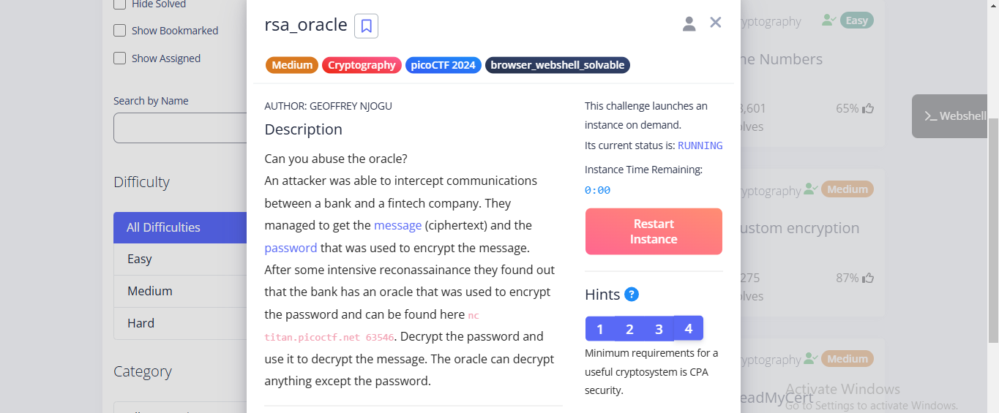
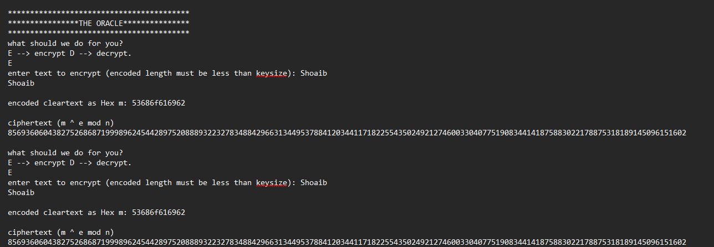
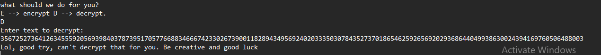
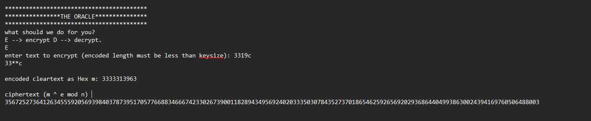
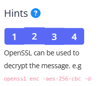
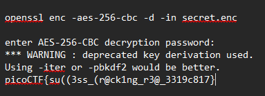

# picoCTF: Rsa_Oracle

## Problem Statement
> Can you abuse the oracle?  
> An attacker was able to intercept communications between a bank and a fintech company. They managed to get the message (ciphertext) and the password that was used to encrypt the message.  
> After some intensive reconnaissance, they found out that the bank has an oracle that was used to encrypt the password and can be found here: `nc titan.picoctf.net 63546`.  
> Decrypt the password and use it to decrypt the message.  
> The oracle can decrypt anything except the password.



## Solution Steps I Used

1. **Connecting to the Oracle**

   I started by connecting to the provided oracle server using `nc`:
   ```bash
   nc titan.picoctf.net 63546
   ```
   
2. **Testing Encryption Consistency**

    Next, I tested how the encryption works by encrypting the same text twice to verify if the encryption method is consistent across        requests. After trying this, I observed that encrypting the same text multiple times produces the same output each time, which           suggests that the encryption process is deterministic.

    

3. **Attempting Direct Decryption of the Password**

    I attempted to decrypt the password directly through the oracle, but the program prevented it. The oracle rejected any attempts to        decrypt the encrypted password directly.

    

4. **Using the RSA Multiplicative Property for Decryption**

    The encryption method used in this challenge follows the standard RSA encryption formula:

    \[
    C = m^e mod n
    \]
    
    Where:
    - \( C \) is the ciphertext,
    - \( m \) is the plaintext message,
    - \( e \) is the public exponent,
    - \( n \) is the modulus.
    
    Since the oracle rejected attempts to directly decrypt the password, I needed to find a way to bypass this limitation. I realized I      could exploit the multiplicative property of RSA.
    
    #### Step-by-Step Process:
    
   **Choose a Random Value**:  
       I selected a random number \( r \), for example, \( r = 3 \).
    
     **Encrypt the Random Number**:  
       I encrypted \( r \) using the RSA encryption formula, resulting in:
 
       [r^e mod n]
       
    
    **Multiply the Encrypted Values**:  
       I then multiplied the ciphertext of the password by the ciphertext of \( r \). This gives:
    
       [(r^e mod n) * (m^e mod n) = (r * m)^e mod n]
       
    
      This expression represents the encrypted value of \( r * m \), where \( m \) is the original password.
    
    **Decryption**:  
       If I sent this new ciphertext to the oracle for decryption. The oracle should decrypt it to give me \( r * m \).
       Now that I had \( r * m \), I could recover the password by dividing the result by \( r \):
    
       [m = (r * m) / r]
    
      This calculation sould reveal the password m.
      To automate the process of solving this challenge, I wrote a Python script that interacts with the oracle and performs the               necessary

   **Python Code to recover the password :**
   ```python
    from pwn import *
    
    context.log_level='critical'
    p = remote("titan.picoctf.net", 63546) #change with the original nc port
    
    p.recvuntil(b"decrypt.")
    
    # Read the encrypted password from the file
    with open("password.enc") as file:
        encp = int(file.read())

   #for direct pass value use encp = [pass_cipher]
    
    # Send command to encrypt random number r (r = 3)
    p.sendline(b"E")
    p.recvuntil(b"keysize): ")
    p.sendline(b"\x03")
    p.recvuntil(b"mod n) ")
    
    # Receive the encrypted random number
    enc3 = int(p.recvline())
    
    # Send command to decrypt the new ciphertext
    p.sendline(b"D")
    p.recvuntil(b"decrypt: ")
    p.sendline(str(enc3 * encp).encode())
    p.recvuntil(b"mod n): ")
    
    # Get the decrypted result and recover the password
    password = int(p.recvline(), 16) // 3
    password = password.to_bytes(len(str(password)) - 7, "big").decode("utf-8")
    
    print("Password:", password)
    ```


   When running the Python script, I was able to successfully decrypt the password. The output of the script was as follows:


 
    ```bash
    Password: 3319c
    ```
 

   Note: The password may vary from user to user.
    
5. **Verifying the Password**
    
    To verify the correctness of the decrypted password, I encrypted it again using the oracle. The resulting encrypted value matched        the one provided in the given file, confirming the password was correct.
    
    
    
6. **Decrypting the Flag with OpenSSL**
    
    In the problem, we found a hint suggesting the use of OpenSSL to decrypt the message. Using the decrypted password, I utilized           OpenSSL to decrypt the message and retrieve the flag.
    
    
    
    The command I used was:
    
    ```bash
    openssl enc -aes-256-cbc -d -in secret.enc
    ```
    
    **Output**:
    
    

**Flag**:
```flag
picoCTF{su((3ss_(r@ck1ng_r3@_3319c817}
```
