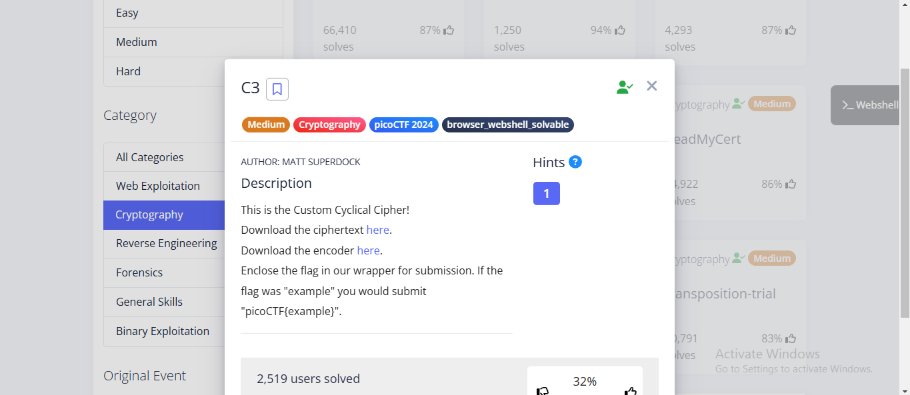
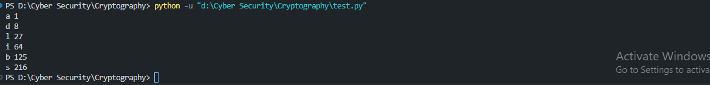

# C3 - picoCTF Problem

**Author**: Matt Superdock

## Description
This is the Custom Cyclical Cipher!
Download the ciphertext and the encoder
Enclose the flag in our wrapper for submission. If the flag was "example" you would submit `picoCTF{example}`.

---

### Problem Images


---

## Encoder Code

```python
import sys
chars = ""
from fileinput import input
for line in input():
    chars += line

lookup1 = "\n \"#()*+/1:=[]abcdefghijklmnopqrstuvwxyz"
lookup2 = "ABCDEFGHIJKLMNOPQRSTabcdefghijklmnopqrst"

out = ""
prev = 0
for char in chars:
    cur = lookup1.index(char)
    out += lookup2[(cur - prev) % 40]
    prev = cur

sys.stdout.write(out)
```

## Encoder Explanation

The encoder reads the input string and uses two lookup tables (lookup1 and lookup2) to transform each character based on a cyclical offset. This offset is updated based on the previous character’s position in `lookup1`.

## Solution
Understanding that reversing the encoder’s process could decrypt the text, I created a reverse version. By initializing `out` as the ciphertext and `prev` as 0, I used the following code:

```python
out = "DLSeGAGDgBNJDQJDCFSFnRBIDjgHoDFCFtHDgJpiHtGDmMAQFnRBJKkBAsTMrsPSDDnEFCFtIbEDtDCIbFCFtHTJDKerFldbFObFCFtLBFkBAAAPFnRBJGEkerFlcPgKkImHnIlATJDKbTbFOkdNnsgbnJRMFnRBNAFkBAAAbrcbTKAkOgFpOgFpOpkBAAAAAAAiClFGIPFnRBaKliCgClFGtIBAAAAAAAOgGEkImHnIl"

lookup1 = "\n \"#()*+/1:=[]abcdefghijklmnopqrstuvwxyz"
lookup2 = "ABCDEFGHIJKLMNOPQRSTabcdefghijklmnopqrst"

chars = ""
prev = 0 
for i in out:
    cur = (lookup2.index(i) + prev) % 40
    chars += lookup1[cur]
    prev = cur

print(chars)
```

This revealed another layer of code in the output : 
```Output1
#asciiorder
#fortychars
#selfinput
#pythontwo

chars = ""
from fileinput import input
for line in input():
    chars += line
b = 1 / 1

for i in range(len(chars)):
    if i == b * b * b:
        print chars[i] #prints
        b += 1 / 1
```
## Analysis:
At first, I tried using various input strings, including random strings and the ciphertext, but none yielded meaningful results. Eventually, I tried using the previous output, which was the revealed code itself, as the input. This returned a string that seemed to be the flag.

## Final Solution Code
I created the following script to automate the process:

```python
#asciiorder
#fortychars
#selfinput
#pythontwo

chars = ""
inp = '''#asciiorder
#fortychars
#selfinput
#pythontwo

chars = ""
from fileinput import input
for line in input():
    chars += line
b = 1 / 1

for i in range(len(chars)):
    if i == b * b * b:
        print chars[i] #prints
        b += 1 / 1
'''
for line in inp:
    chars += line
b = 1 / 1

for i in range(len(chars)):
    if i == b * b * b:
        print(chars[i], i) #prints with index
        b += 1 / 1
```

## Solution Output
The code produced an output that resembled the flag. Here’s a screenshot of the result:



## Flag
```flag
picoCTF{adlibs}
```
