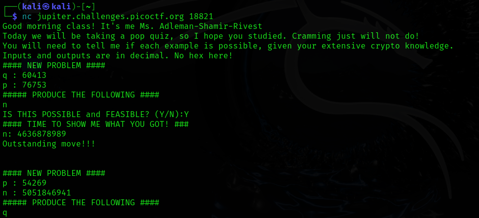
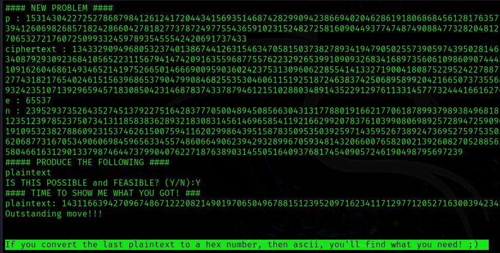

# picoCTF: rsa-pop-quiz

## Problem Statement
> Class, take your seats! It's PRIME-time for a quiz... nc jupiter.challenges.picoctf.org 18821


## Solution Steps I Used

1. **Connecting to the nc**

   I started by connecting to the provided nc server using `nc`:
   ```bash
   nc jupiter.challenges.picoctf.org 18821
   ```

The Server Response With:


#### **2. Understand the Problems**

Each problem specifies the inputs and asks whether a computation is feasible (Y/N). If feasible, you must provide the correct output. Key RSA concepts include:

-   n=p×q 
-   ϕ(n)=(p−1)×(q−1)
-   d≡e^−1  mod ϕ(n )
-   RSA encryption: Ciphertext, c= m^e mod n = `pow(m, e, n)`.
-   RSA decryption: Plaintext, m= c^d mod n = `pow(c, d, n)`.

#### **3. Solving Each Problem**

----------


**Problem 1**

-   **Given**:  q = 60413, p = 76753
-   **Task**: Compute n.
-   **Solution**:  n = q × p = 60413 × 76753 = 4636878989
-   **Response**:  
    `Y`  
    `n: 4636878989`

----------

**Problem 2**

-   **Given**:  p = 54269, n = 5051846941
-   **Task**: Compute q.
-   **Solution**:  q = n / p =5051846941 / 54269 = 93089
-   **Response**:  
    `Y`  
    `q: 93089`

----------

**Problem 3**

-   **Given**:   e = 3, large n
-   **Task**: Find q and p.
-   **Solution**: Not feasible as n is too large to factorize directly.
-   **Response**:  
    `N`

----------

**Problem 4**

-   **Given**:  q=66347, p = 12611
-   **Task**: Compute ϕ(n)\phi(n).
-   **Solution**:  ϕ(n) = (p−1) × (q−1) = (12611−1) × (66347−1) = 836623060
-   **Response**:  
    `Y`  
    `totient(n): 836623060`

----------

**Problem 5**

-   **Given**:  
    plaintext=6357294171…, e = 3, n=291294636093…
-   **Task**: Compute ciphertext.
-   **Solution**:  c= m^e mod n = `pow(m,e,n)`
    -   Result:  
        c=2569312466317827143…
-   **Response**:  
    `Y`  
    `ciphertext: 2569312466317827143...`

----------

**Problem 6**

-   **Given**:  
    ciphertext=107524013451… , e = 3, large n
-   **Task**: Compute plaintext.
-   **Solution**: Not feasible as n is too large to factorize directly.
-   **Response**:  
    `N`

----------

**Problem 7**

-   **Given**:  q = 92092076805…, p = 97846775312…, e = 65537
-   **Task**: Compute d.
-   **Solution**:
    1.  ϕ(n) = (p−1) × (q−1)
    2.  d = e^−1mod  ϕ(n)  = `pow(e, -1, ϕ(n))`
    
    -   Result:  
        d=1405046269503207469…
-   **Response**:  
    `Y`  
    `d: 1405046269503207469...`

----------

**Problem 8**

-   **Given**:  p=15314304227…, ciphertext=13433290949…, e=65537, n=23952937352…
-   **Task**: Compute plaintext.
-   **Solution**:
    
    1.  ϕ(n) = (p−1) × (q−1) 
    2. d = e^−1mod  ϕ(n)  = `pow(e, -1, ϕ(n))`
    3.  Plaintext, m= c^d mod n = `pow(c, d, n)`.
    
    -   Result:  
        plaintext=1431166394270967486…
    -   Convert to hex and ASCII:  
        Final result is the flag.
-   **Response**:  
    `Y`  
    `plaintext: 1431166394270967486...`



----------
#### **4. Final Task**
Solving the Last Problem resulted with a text :
`If you convert the last plaintext to a hex number, then ascii, you'll find what you need! ;)`

Now converting the plain text in strings and other formats using the python script :
```
from  Crypto.Util.number  import  inverse, long_to_bytes

m  =  14311663942709674867122208214901970650496788151239520971623411712977120527163003942343369341

plaintext_bytes  =  long_to_bytes(m)
plaintext_str  =  plaintext_bytes.decode('utf-8', errors='replace')

print(f"Plaintext (bytes): {plaintext_bytes}")
print(f"Plaintext (string): {plaintext_str}")
print(f"Plaintext (integer): {m}")
```
**Output :**
```
Plaintext (bytes): b'picoCTF{wA8_th4t$_ill3aGal..oa2d2239b}'
Plaintext (string): picoCTF{wA8_th4t$_ill3aGal..oa2d2239b}
Plaintext (integer): 14311663942709674867122208214901970650496788151239520971623411712977120527163003942343369341
```
----------

### **Flag**

After converting the final plaintext to ASCII, the flag is revealed.

**Flag**: `picoCTF{wA8_th4t$_ill3aGal..oa2d2239b}`

----------
